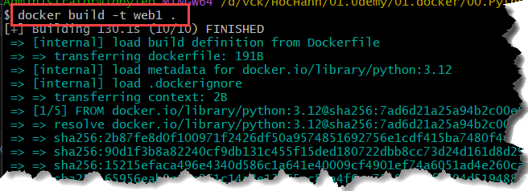
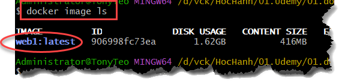

#

## Bài 1: 
1 Flask app + 1 container (Image, Container, Port Mapping).

### Mục tiêu:
- Tạo trang web đơn giản bằng python version 3.12, sử dụng thư viện Flask version 3.0.3
- Tạo file `requirements.txt` chưa các thư viện cần cài
- Tạo file `Dockerfile` để thực hiện tự động:
    - copy/cài đặt python 3.12 vào container
    - copy các file cần thiết từ source vào container
    - Thực hiện cài đặt các thư viện cho dự án
    - Khởi động web site
- Build Image and container
- Khởi động container vừa build

### Thực hiện:

1. Tạo file `app.py`
2. Tạo file `requirements.txt`
3. Tạo file `Dockerfile`

> Nội dung các file trên trong thư mục `Bai_01`

4. Build Image and container

    - Build Image

    ```bash
    # buộc phải đứng tại thư mục "Bai_01" chứa các file vừa tạo các bước trên
    # cd /c/docker/Bai_01
    docker build -t web1 .
    ```
    

    - Xem Image/kết quả:
    ```bash
    docker image ls
    # hoặc
    docker images
    ```

    

    - Run container
    ```bash
    docker run -d \ 
    --name web1 \
    -p 9001:9001 \
    web1:latest 
    ```
    > - -d: Viết tắt của --detach, chạy ngầm
    > - --name web1: Đặt tên cho container này là web1. có thể đặt tên khác
    > - -p 9001:9001: `<port máy local>:<port container>`
    > - web1:latest: là tên của `Docker Image`
    > - **Hay**: Hãy chạy ngầm `-d` một container có tên `--name` là web1, được tạo ra từ image ``web1``. Đồng thời, mở cổng `9001 trên máy chủ` để kết nối trực tiếp với cổng `9001 bên trong container`.

    - Xem kết quả/container
    ```bash
    docker ps
    ```
5. Test

Mở trình duyệt chạy `http://localhost:9001`
