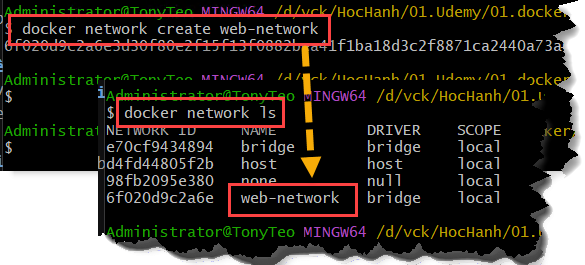
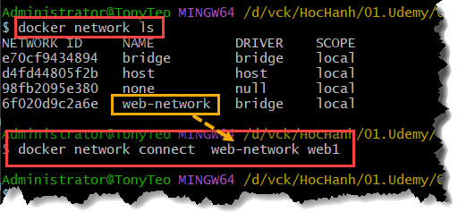
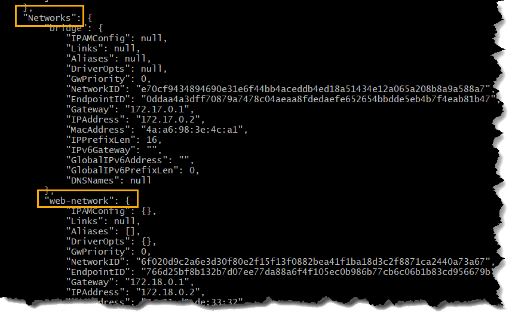
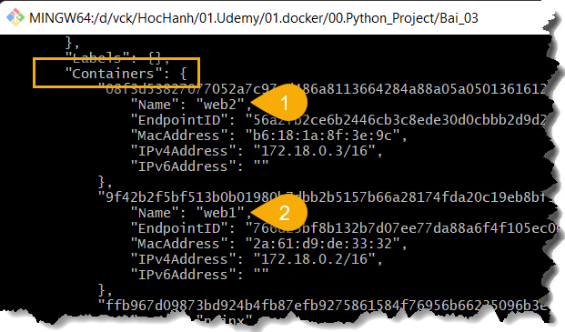

#


## Bài 2: 
2 Flask app + Docker Network (DNS nội bộ, giao tiếp giữa container).

### Mục tiêu:
- Tạo web với Flask app 
- Tạo docker network

### Thực hiện:

#### - Tạo web với Flask app 
(Tương tự bài 1)

#### - Tạo Docker Network

```bash
# Tạo card mạng có tên "web-network"
docker network create web-network

# hiển thị các mạng
docker network ls
```


#### - Gắn container vào network

```bash
docker network connect  web-network web1

docker network connect  web-network web2
```



#### - Kiem tra

```bash
docker inspect web1
docker inspect web2
```


- Kiểm tra web1, web2 có thật sự có trong `web-network` chưa
```bash
docker network inspect web-network
```


