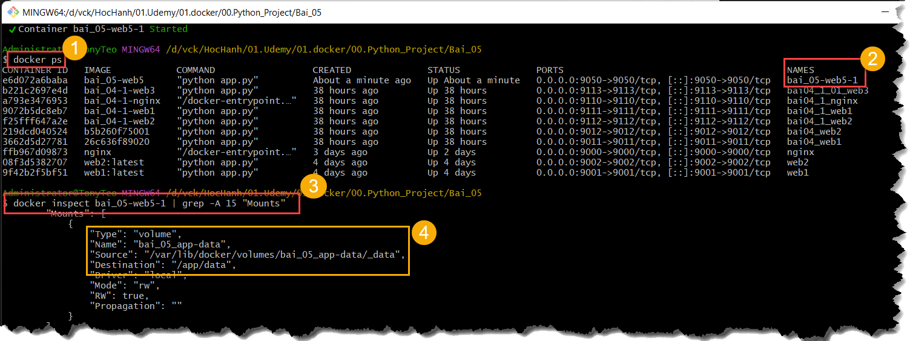
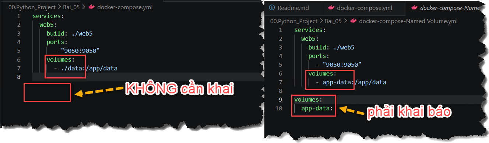
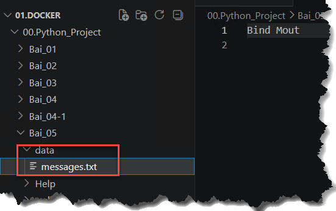
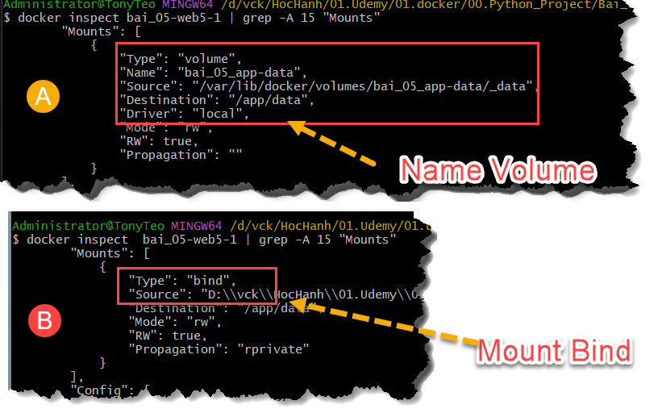

#

## Bài 5 — Persist dữ liệu bằng Volume

### 1. Mục tiêu:

Xây dựng một Flask web đơn giản:

- Truy cập web để thêm nội dung.
- Nội dung được lưu vào file messages.txt.
- Xóa và tạo lại container.
- Dữ liệu vẫn còn nhờ Volume.

### 2. Ý tưởng:

- Volume tách dữ liệu khỏi vòng đời container
```bash
Trình duyệt
    │
localhost:9020
    │
Flask Container
    │
/app/data/messages.txt
    │
Docker Volume
```
Source code nằm trong image, còn file dữ liệu nằm ngoài vòng đời container.

### 3. Thực hiện

#### 3.1 Tạo cấu trúc thư mục
```bash
# cấu trúc cuối cùng
Bai_05/
│
├── docker-compose.yml
│
└── web5/
    ├── app.py
    ├── requirements.txt
    ├── Dockerfile
    └── app/ 
      ├── data/
          ├──messages.txt

# Nhưng không cần tạo data trước, vì Docker Volume sẽ gắn trực tiếp vào /app/data trong container.
Bai_05/
│
├── docker-compose.yml
│
└── web5/
    ├── app.py
    ├── requirements.txt
    ├── Dockerfile
```

#### 3.2 Nội dung các file (xem trong thư mục bai_05\web5)
- **app.py**: 1 web đơn giản nhập liệu từ web và dữ liệu lưu vào file `/app/data/messages.txt`
- **requirements.txt**
- **Dockerfile**
- **Tạo `docker-compose.yml` chưa có Volume**

#### 3.3 Build và test

##### 3.3.1: Build và chứng mình dữ liệu mất khi xóa container (vì chưa tạo volume)

- Build
```bash
docker compose up -d --build

# kiểm tra
docker compose ps

# test Truy cập và nhập liệu
http://localhost:9050

# nhập liệu xong mở file message.txt ra xem (mở trực tiếp bên trong container)
docker compose exec web5 sh -c 'cat /app/data/messages.txt'
```
- Xóa container

```bash
docker compose down
docker compose up -d

```

Truy cập lại `http://localhost:9050` dữ liệu cũ sẽ không còn. Đây là kết quả mong muốn vì container cũ đã bị xóa

##### 3.3.2 Named Volume
Docker quyết định nơi lưu

- Sửa `docker-compose.yml`, nội dung đầy đủ

```YAML
services:
  web5:
    build: ./web5
    ports:
      - "9050:9050"

    volumes:
      - app-data:/app/data

volumes:
  app-data:
```

- Xóa và build lại:
```bash
docker compose down

docker compose up -d --build

# kiểm tra volume
docker volume ls

```bash
docker inspect  bai_05-web5-1 | grep -A 15 "Mounts"
```


- Luồng dữ liệu hiện tại
```bash
Flask ghi /app/data/messages.txt
              │
              ▼
Named Volume bai_05_app-data
              │
              ▼
Dữ liệu tồn tại độc lập với container
```
Nếu xóa cả container và volume, lúc đó dữ liệu mất, bằng cách thêm `-v`
```bash
docker compose down -v
```

##### 3.3.3 Bind Mount
- Cấu trúc thư mục (tạo mới thư mục `data` đồng cấp với `web5`)
```bash
Bai_05/

│
├── docker-compose.yml
├── data/
└── web5/
```

- Nội dung file `docker-compose.yml` mới là
```bash
services:
  web5:
    build: ./web5
    ports:
      - "9050:9050"
    volumes:
      - ./data:/app/data
```


> Ghi chú: phân biệt Name Volume và Mount Bind
> - Nếu bên trái là tên -> phải khai báo
> - Nếu bên trái là đường dẫn - KHÔNG cần khai báo

- Xóa container và volume
```bash
docker compose down -v

# nếu volume chưa xóa thì list volume hiện tại và xóa bằng tay
docker volume ls

docker volume rm <tên volume cấn xóa>

# ví dụ:
docker volume rm bai_05_app-data
```

- Chạy lại và truy cập nhập liệu sẽ thấy file trong phần data\messages.txt
```bash
docker compose up -d --build
```



- Khác biệt giữa **Named Volume** và **Bind Mount**
