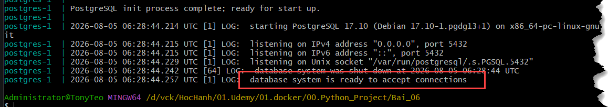
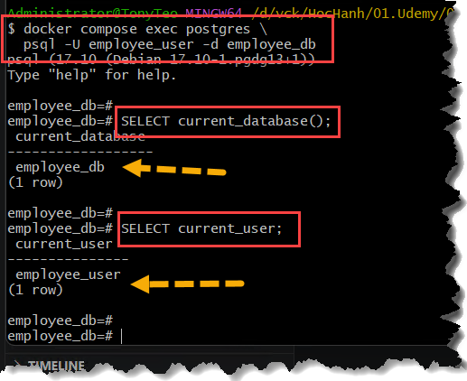

#

## BÀI 6 - Triển khai ứng dụng Web thực tế (Flask + PostgreSQL + Nginx)

### MỤC TIÊU:
```bash
Browser
   │
http://localhost:9060
   │
Nginx container
   │
web6:9061
   │
PostgreSQL container:5432
   │
Named Volume
```
### PHẦN A: Developer

#### STEP 1:

##### 1. Cấu trúc Project

```bash
Bai_06/

│
├── docker-compose.yml
│

├── nginx6/
├──────── Dockerfile
├──────── nginx.conf
│

├── web6/
├────── Dockerfile
├────── requirements.txt
│
├────── app.py
├────── models.py
├────── database.py
│
├────── templates/
├─────────────── index.html

│
└── postgres/

         (không có Dockerfile, dùng file gốc từ doker hub)
```

##### 2. Tư duy MVC
```bash
Browser

     │

Controller

(app.py)

     │

Model

(models.py)

     │

Database

(PostgreSQL)
```

```bash
# HTML templates, Flask sẽ render dùng để view
Model

↓

View

↓

Controller
```

##### 3. Database Design

```bash
| Field      | Type        | Ghi chú |
| ---------- | ----------- | ------- |
| id         | Integer     | PK      |
| name       | String(100) |         |
| department | String(100) |         |
| position   | String(100) |         |
| email      | String(150) | Unique  |
| created_at | DateTime    | Auto    |

```

##### 4. Luồng hoạt động

```bash
Browser

↓

Add Employee

↓

Flask

↓

SQLAlchemy

↓

PostgreSQL

↓

Response

↓

Browser
```

#### STEP 2:

##### Mục tiêu

Làm cho Flask kết nối được PostgreSQL.
```bash
Flask
    │
Connected
    │
PostgreSQL
```
- Tạo các file: `requirements.txt`, `database.py`, `models.py`, `app.py`, `Dockerfile`

### PHẦN B: DevOps

```bash
docker compose up -d --build postgres web6

# kiem tra
docker compose up

docker compose logs postgres
```
- Cuối log nên có nội dung

```bash
database system is ready to accept connections
```


- Kiểm tra database trực tiếp

```bash
docker compose exec postgres \
  psql -U employee_user -d employee_db

# hoặc
docker compose exec postgres psql -U employee_user -d employee_db

SELECT current_database();

SELECT current_user;

# nhấn \q để thoát khỏi SQL
\q
```



- Truy cập
```bash
http://localhost:9061/
```

