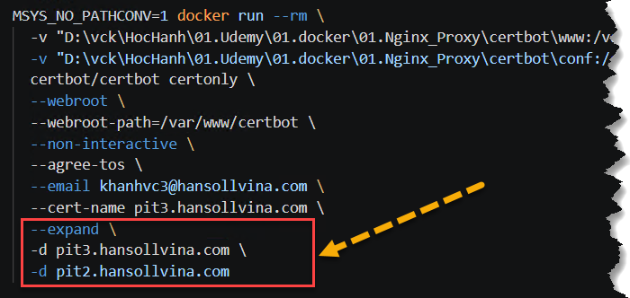
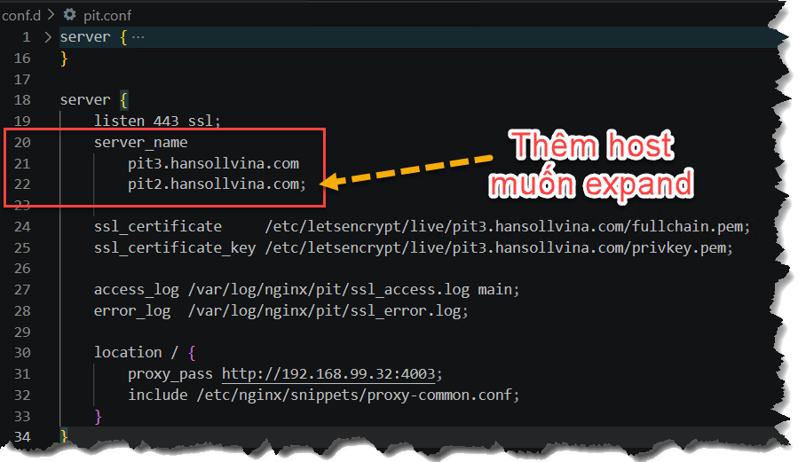

#
Xin 1 CA, expand CA (certificate) cho nhiều CA cùng cấp.
Ví dụ xin CA cho `pit3` expand thành `pit2 + pit3`


## 1. Expand CA

```bash
MSYS_NO_PATHCONV=1 docker run --rm \
  -v "D:\vck\HocHanh\01.Udemy\01.docker\01.Nginx_Proxy\certbot\www:/var/www/certbot" \
  -v "D:\vck\HocHanh\01.Udemy\01.docker\01.Nginx_Proxy\certbot\conf:/etc/letsencrypt" \
  certbot/certbot certonly \
  --webroot \
  --webroot-path=/var/www/certbot \
  --non-interactive \
  --agree-tos \
  --email khanhvc3@hansollvina.com \
  --cert-name pit3.hansollvina.com \
  --expand \
  -d pit3.hansollvina.com \
  -d pit2.hansollvina.com

```



## 2. Thêm host vào file host .conf
- Ví dụ: pit.conf
```bash
server {
    listen 443 ssl;
    server_name               <-- thêm chổ này
        pit3.hansollvina.com
        pit2.hansollvina.com; 
...
...
}
```



## 3. Test

```bash
docker exec nginx-proxy nginx -t
docker exec nginx-proxy nginx -s reload

#
curl -I https://pit2.hansollvina.com
curl -I https://pit3.hansollvina.com

# hoặc trực tiếp từ trình duyệt
```