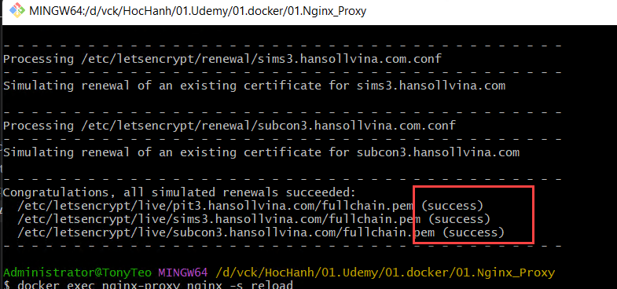

#

## I. MỤC TIÊU
- Test renew CA
- Lập lịch chạy hằng ngày và chỉ renew CA còn < 5 ngày là hạn

### Quy trình hoàn chỉnh
```bash
Certbot renew
      ↓
certificate mới
      ↓
Nginx reload
      ↓
Nginx sử dụng certificate mới
```

### Windows Task Scheduler
```bash
Task Scheduler
      ↓
docker run ... certbot renew
      ↓
docker exec nginx-proxy nginx -s reload
```

## II. THỰC HIỆN:

### 1. Test Renew CA
```bash
MSYS_NO_PATHCONV=1 docker run --rm \
  -v "D:\vck\HocHanh\01.Udemy\01.docker\01.Nginx_Proxy\certbot\www:/var/www/certbot" \
  -v "D:\vck\HocHanh\01.Udemy\01.docker\01.Nginx_Proxy\certbot\conf:/etc/letsencrypt" \
  certbot/certbot renew \
  --dry-run
```
Nếu thành công mới renew thật




### 2. Renew CA

#### Loggic:
```bash
Task Scheduler chạy mỗi ngày
        ↓
Kiểm tra từng certificate
        ↓
Còn > 5 ngày
        → Không làm gì
        ↓
Còn ≤ 5 ngày
        → certbot renew --cert-name ... --force-renewal
        ↓
Renew thành công
        → reload Nginx
```
- Scripts theo logic:
```bash
1. đọc expiry của từng cert
2. tính DaysLeft
3. nếu DaysLeft <= 5:
      renew đúng --cert-name
4. nếu có ít nhất một cert renew thành công:
      docker exec nginx-proxy-v2 nginx -t
      docker exec nginx-proxy-v2 nginx -s reload
5. ghi log
```
- Scripts chính `renew-cert.ps1`
- Bat gọi **renew-cert.ps1** `renew-cert.bat`
- Lập lịch


### 3. RENEW manual
```bash
MSYS_NO_PATHCONV=1 docker run --rm \
  -v "D:\vck\HocHanh\01.Udemy\01.docker\01.Nginx_Proxy\certbot\www:/var/www/certbot" \
  -v "D:\vck\HocHanh\01.Udemy\01.docker\01.Nginx_Proxy\certbot\conf:/etc/letsencrypt" \
  certbot/certbot renew

# nếu thành công
docker exec nginx-proxy-v2 nginx -s reload
```
